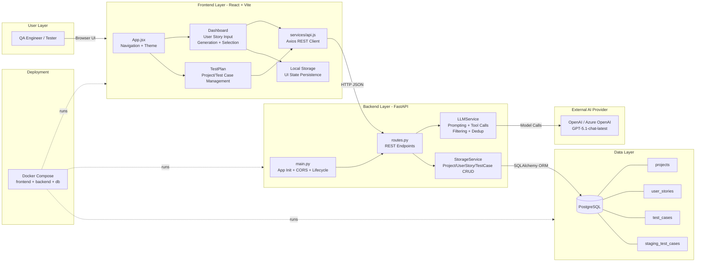
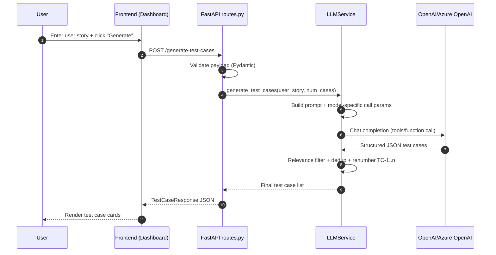

# AI Test Case Generator - Architecture Diagram

## High-Level Architecture

## Main Request Flow (Test Case Generation)

## Notes for Thesis Presentation

- Layered architecture: presentation, orchestration, integration, persistence.
- Generation quality is enforced by a pipeline (prompting + filtering + dedup), not only by model output.
- Two-phase persistence pattern: staging (temporary) and project storage (durable).
- Provider abstraction allows switching between OpenAI and Azure OpenAI without frontend changes.
